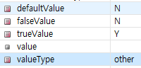

# 개발 순서

### UI 단

0. `/pub` 폴더에서 파일 복사해서 UI 폴더에 새 **UICMS0001.xml** 파일 생성

   ```
   COMUiTopBtnUdc (SAVE/CLEAR) 복사
   COMUiSrchBoxBtnUdc (Retrieve) 복사
   COMUiGridViewTopBtnUdc (row 추가,제거 / 엑셀 업,다운 / ..) 복사
   ```

1. [DataCollection] 생성하기

   - DataCollection ID : 모두가 알아볼 수 있게
   - Column ID : SQL 파일의 컬럼명 참고
   - Column Name : UI 설계서의 컬럼명 참고
   - 종류
     - DataMap : 데이터 1개
     - DataList : 데이터 여러 개

2. [Design]과 [DataCollection] 연결하기

   - Grid 눌러서 [Property]에서 위에서 만든 DataCollection 선택
- 각각의 Column의 [Property]에서 해당 Column ID 찾아서 연결
  
3. `vo`폴더에서 새 **xxxVo.java **파일 생성

   - SQL문의 컬럼들을 카멜 표기법으로 변환해서 입력

   - alias로 지정한 컬럼명은 vo도 alias명으로 입력

   - setter / getter 함수 생성

     ``` java
     import hmm21.framework.support.AbstractValueObject;
     @SuppressWarnings("serial")
     public class CmsLeaseTermVo extends AbstractValueObject { ... }
     ```

4. [Script] 단에서 코딩

   - `ref` : UI단에서 Back(DB)단으로 가져갈 조건

     - `var ref = null`이면 가져갈 조건이 없으므로 query에서 `parameterType =""` 조건이 없음
     - `var ref != null`이면 가져갈 조건이 있으므로 query에서 `parameterType =""` 조건이 있음

   - `target` : Back단에서 담아서 UI단으로 가져오는 변수

     - Update / Delete / Insert 기능을 수행할 경우, `var target = null`이기 때문에 query에서 `resultType =""` 조건이 없음
     - Select 기능을 수행할 경우, `var target != null`이므로 query에서 `resultType =""` 조건이 있음

   - **반드시 같아야 함**

     - common.execute("**searchLseTpCdList**", "**/UICMS0001/searchLseTpCdList.do**", ..) 와

       @RequestMapping(value="**/UICMS0001/searchLseTpCdList.do**")

       public HmmModel **searchLseTpCdList()** throws BusinessException { ... }

   ```javascript
   // UICMS0001.xml - [Script]
   scwin.onpageload = function() {
   		...
   		var promise = common.execute("searchLseTpCdList", "/UICMS0001/searchLseTpCdList.do", ref, target, null);
       ...
   }
   ```

   ``` java
   // Cms0001Controller.java
   import hmm21.framework.core.exception.BusinessException;
   @RequestMapping(value="/UICMS0001/searchLseTpCdList.do")
   	public HmmModel searchLseTpCdList() throws BusinessException {
   		HmmModel model = new HmmModel();
   		try {
   			/* Service Class 호출, DB에서 조회한 Data를 UI로 넘겨준다. */
               // DataCollection ID와 동일
   			model.addObject("dlLseTpCdList", service.searchLseTpCdList());
               ...
           }
       }
   }
   ```


--------------------

### Back단

5.`/code` 바로 아래에 새 **Cms0001Controller.java** 파일 생성

- Controller Annotation 추가

  ``` java
  import org.springframework.stereotype.Controller;
  @Controller
  ```

- HmmController 상속받기

  ``` java
  import hmm21.framework.support.controller.HmmController;
  public class Cms0001Controller extends HmmController {...}
  ```

- Logger 추가

  ``` java
  import org.slf4j.Logger;
  import org.slf4j.LoggerFactory;
  private static final Logger log = LoggerFactory.getLogger(Cms0001Controller.class);
  ```

- 새 Service 선언

  ``` java
  import javax.annotation.Resource;
  @Resource
  private CmsLeaseTypeService service;
  ```

- 새 함수 정의

  - **RequestMapping의 value는 script단과 정확히 일치해야 함**
  - `throws BusinessException` 추가
  - HmmModel 생성
  - **addObject의 Key값은 UI의 DataCollection명과 정확히 일치해야 함**

  ``` java
  import org.springframework.web.bind.annotation.RequestMapping;
  import hmm21.framework.core.exception.BusinessException;
  import hmm21.framework.core.servlet.HmmModel;
  
  @RequestMapping(value="/UICMS0001/searchLseTpCdList.do")
  public HmmModel searchLseTpCdList() throws BusinessException {
  		HmmModel model = new HmmModel();
  		try {
  			/* Service Class 호출, DB에서 조회한 Data를 UI로 넘겨준다. */
              // UI의 DataCollection명과 일치해야 함
  			model.addObject("dlLseTpCdList", service.searchLseTpCdList());
  		} catch (BusinessException e) {
  			throw e;
  		} catch (Exception e) {
  			log.error(e);
  			/* Exception 발생 시 사용자 메세지 */
  			throw new BusinessException(e);
  		}
  		return model;
  	}
  ```

6. `/service`폴더 아래에 새 **CmsXxxService.java** interface 생성

   - Controller의 함수명과 동일하게 명명

   - `throws BusinessException` 추가

     ``` java
     import hmm21.framework.core.exception.BusinessException;
     public List<Cms변수명Vo> Controller의함수명() throws BusinessException;
     ```

7. 새 **CmsXxxServiceImpl.java** 파일 생성

   - Service Annotation 추가

     ``` java
     import org.springframework.stereotype.Service;
     @Service
     ```

   - HmmService 상속받기 & 구현할 Service 

   - Logger 추가

     ``` java
     import org.springframework.stereotype.Service;
     import org.slf4j.Logger;
     import org.slf4j.LoggerFactory;
     
     @Service
     public class CmsXxxServiceImpl extends HmmService implements CmsXxxService { 
     	private static final Logger log = LoggerFactory.getLogger(CmsXxxServiceImpl.class)};
     ```

   - Resource Annotation 추가 + DefaultCommonDao 선언

   - String 변수에 Query의 Namespace 정의

     ``` java
     import javax.annotation.Resource;
     import hmm21.framework.support.mybatis.DefaultCommonDao;
     public class CmsXxxServiceImpl extends HmmService implements CmsXxxService { 
     @Resource
     	private DefaultCommonDao commonDao;
     	private final String cmsXxxNs = "hmm21.eqm.cms.code.query.CmsXxx(query파일명).";
     }
     ```

   - DB에 조회하고 결과를 변수에 담아 받아옴

     ```JAVA
     @Override
     	public List<Cms변수명Vo> Controller의함수명() throws BusinessException {
     		List<Cms변수명Vo> resultList = new ArrayList<Cms변수명Vo>();
     		try {
     			// DB에서 가져오는 데이터가 멀티 row이므로 selectList로 받아옴
     			resultList = commonDao.selectList(cmsXxxNs + "Controller의함수명");
     		} catch (Exception e) {
     			log.error(e);
     			throw new BusinessException(e);
     		}
     		return resultList;
     	}
     ```

8. `/query` 폴더 아래에 새 **CmsXxx.xml** 파일 생성

   - sql 파일 복사 후 붙여넣기

   - 위에서 String에 담아놓은 Namespace 복사

     ``` sql
     <mapper namespace="hmm21.eqm.cms.code.query.CmsLeaseType">
     	<select id="Controller의함수명" parameterType = "xxx" resultType="hmm21.eqm.cms.code.vo.CmsXxxVo">
     	SQL 파일 붙여넣기
     	</select>
     </mapper>
     ```


----------

### 페이지 로딩

`/menu_local.xml`

``` xml
<w2:row>
    <mnuNo><![CDATA[tmp1]]></mnuNo>
    <mnuNm><![CDATA[UICMS0001]]></mnuNm>
    <pgmUrl><![CDATA[/ui/container/eqm/cms/code/UICMS0001_T.xml]]></pgmUrl>
    <lvl><![CDATA[2]]></lvl>
    <prntMnuNo><![CDATA[LOCAL]]></prntMnuNo>
</w2:row>
```

- 새로운 페이지 추가
- server ON
- http://localhost:7001/index.do 들어가보기


---------

### Class

- `class = req` : 그리드 필수 입력 체크

  ​				           해당 컬럼 제목과 inputBox 모두 class = req 지정
  
  - 그리드 필수 체크는 필수 체크하고자 하는 셀(col명)과 콤포넌트에  ‘req’라는 클래스를 추가 하여야 validation 체크 가능
  
    ``` js
    common.validateGridView("그리드ID명");  // 공통 함수를 호출가능
    ```

- `class = uppercase` : 대문자
- `class = rightbox` : 오른쪽에 위치
- `class = leftbox` : 왼쪽에 위치


#### 코드명에 해당하는 데이터 가져오기

```JS
var arrJson = [{ code : "C06313", compID:"selPartner"},
			   { code : "코드명", compID:"가져온 데이터를 담을 UI 컴포넌트명"}
			  ];

var promise = common.setComCode(arrJson);
promise = promise.then(function(res){
});
```

#### UDC의 add Row 버튼 클릭 이벤트

```js
scwin.udcGridTopBtns_onRowAddClick = function(e) 
	// dataCollection의 전체 행의 갯수 가져옴
    var idx = dataCollection명.getTotalRow();
	// idx에 해당하는 새로운 row 생성
    dlSendBlkList.insertRow(idx);

	// TD : 조회시에는 비활성화, Row Add 일때는 입력가능
    GridView명.setCellReadOnly(idx, "spvrCd", false);
    GridView명.setCellReadOnly(idx, "cntrNo", false);

	// 행 추가시 spvrCd (selectBox)의 목록이 펼쳐져서 보여짐
    GridView명.setFocusedCell(idx, "spvrCd", true);
};
```

#### onviewchange 함수 : 셀의 데이터가 키보드나 마우스 조작을 통해 변경된 경우에만 발생

``` xml
<!-- 파라메터 --> 
<Number> info.rowIndex : 이벤트가 일어난 셀의 row index로 displayRowIndex를 반환한다.
     					  (displayRowIndex란 화면에 현재 보이는 그리드뷰를 기준으로 계산한 row index를 말한다) 
<Number> info.colIndex : 이벤트가 일어난 셀의 column index 
<String> info.oldValue : 이벤트가 일어난 셀의 이전 value
<String> info.newValue : 이벤트가 일어난 셀의 변경된 value
```

``` js
scwin.gvCntrSendBlock_onviewchange = function(info) {
    	// 바뀐 컬럼명에 따라 다른 기능 수행
		switch(gvCntrSendBlock.getColumnID(info.colIndex)) {
			case "컬럼명1" :
                ...
                break;
            case "cntrNo" :
            // dmContainer DataMap의 새 cntrNo 컬럼에
			// dlCntrSendBlock DataList의 cell 중 rowIndex번째(데이터가 바뀐 행)의 cntrNo의 데이터를 가져와서 저장
                dmContainer.set( "cntrNo", dlCntrSendBlock.getCellData( info.rowIndex , "cntrNo"));
                break;
           
		}
	};
```

#### DataList의 Total 갯수 관련 함수들

- ondataload 함수 : DataList의 data가 전체적으로 변경되는 경우 발생하며, data가 셋팅된 이후에 이벤트 발생

​								  setJSON, setXML, setData 류의 API가 해당됨 ( 해당 API를 통해 append 할 경우에도 발생 )

​								  단, removeAll 호출 시에는 해당 이벤트는 발생하지 않으며, 대신 onremoverow 이벤트가 발생함

- onremoverow 함수

- oninsertrow 함수

  ``` js
  // dataCollection tab에서 오른쪽 마우스 클릭 - [이벤트 추가] - onDataLoad 클릭
  // DataList 갯수 변경시 Total 갯수 변경 처리 : CUD
  
  // 데이터가 set 되었을때
  scwin.dlSendBlkList_ondataload = function() {
      // spTotal : Total 갯수를 체크하는 UI 컴포넌트명
      spTotal.setValue(dlSendBlkList.getRowCount());
  };
  
  // row가 삭제 되었을 때
  scwin.dlCntrSendBlock_onremoverow = function(info) {
      spTotal.setValue(dlCntrSendBlock.getRowCount());
  };
  
  // row가 추가 되었을 때
  scwin.dlCntrSendBlock_oninsertrow = function(info) {
      spTotal.setValue(dlCntrSendBlock.getRowCount());
  };
  ```

#### Excel 관련 함수

- onExcelDownClick 함수

  ``` js
  scwin.udcGridTopBtns_onExcelDownClick = function(e) {
  		var excelOpt = { 
  				rowNumVisible : true,
  				removeColumns : "데이터 중 download에서 제외할 컬럼",
  				fileName : "저장할 Excel명.xls",
  				title : "엑셀 파일 제일 첫 행"
  		};
  		common.gridDataDownLoad("gvCntrSendBlock", excelOpt);
  	};
  ```

- onExcelUpClick 함수 : Excel upload 클릭시 실행되는 함수

  ``` js
  scwin.udcGridTopBtns_onExcelUpClick = function(e) {
      common.clearDataList("Excel에서 데이터를 읽어와서 담을 datacollection명");
      var excelOpt ={ 
                startRowIndex : "읽어오기 시작할 row의 index"
              , startColumnIndex : -1
      };
      common.gridDataUpLoad("gvCntrSendBlock", "xls", excelOpt);
  };
  ```

- onfilereadend 함수 : excel Upload가 끝난 후 실행되는 함수

  ​									 Validation 체크

----------------------

#### Location combobox (by UICIN0014.xml) 

> UIEQP0020.xml 참고

- Location : EQ.Area / EQ-subarea / EQ.Cntrl.Ofc/ Loca.GRP / EQ.Loc


​	[돋보기 클릭시 팝업화면]


- Script 

```JS
scwin.onpageload = function() {
    var arrJson = [ {code:"C05539", compID:"sLocation_1"}];
    var promise = common.setComCode(arrJson);
    promise = promise.then(function (arr) {
        //dlC05539.removeRow( 0 );
        sLocation_2.setEqParam( { "commonCd":"C05539", "detailCd":"A", "isMulti":"Y" } );//udc에 넘겨주는 파라메터 셋팅
    });

};

scwin.sLocation1_onviewchange = function(info) {
    dmRepoInWeeklySetup.set("locCd","");
    if(info.newValue == "F"){
        //sLocation_2의 클레스에 req 속성을 해제하는 로직이 필요함
        //sLocation_2.setReqClass("N");//udc req Class remove
        sLocation_2.setStyle( "display" , "none" );
    }else{
        sLocation_2.setStyle( "display" , "" );
        sLocation_2.setStyle( "width" , "200px" );
        //sLocation_2.setReqClass("Y");//udc req Class add
        //sLocation_2의 클레스에 req 속성을 주는 로직이 필요함
        sLocation_2.setEqParam( { "commonCd":"C05539", "detailCd":info.newValue, "isMulti":"Y"} );//udc에 넘겨주는 파라메터 셋팅
    }
};

/*Location Value change event*/
scwin.sLocation2_onUdcChange = function() {
    var rValue = dmRepoInWeeklySetup.get( "locCd" );
    var setVal = "";
    var rtnVal = "";

    if(rValue != ""){
        var lvl;
        switch( sLocation_1.getValue() ) {
            case "A" :
            lvl = 1;
            break;
            case "S" :
            lvl = 2;
            break;
            case "G" :
            lvl = 3;
            break;
            case "T" :
            lvl = 4;
            break;
            case "E" :
            lvl = 5;
            break;
        }
        cdSearch.setEmptyValue();
        cdSearch.reform();

        cdSearch.set( "searchLvl" , lvl );
        cdSearch.set( "searchCd" , rValue );

        var ref     = [{id:"cdSearch", key:"cdSearch"}];
        var target  = [{id:"cdResult", key:"cdResult"}];
        var promise = common.execute("searchLocationCd", "/UCIN0005/searchLocationCd.do", ref, target, null, this);
        promise = promise.then(function (res) {
            if(res.totalCnt == "1") {
                dmRepoInWeeklySetup.set( "locCd",cdResult.getCellData( 0 , "cd" ));
            }else{
                dmRepoInWeeklySetup.set( "locCd","");
            }
        });
    }
};
```

- Datacollection

  - dmRepoInWeeklySetup

    ``` 
  [id]	 [name]
    eqpKind	 eqpKind
    locCd	 locCd
    ```
  
  - cdSearch ( DataMap )

    ```
    [id]		[name]
    searchLvl	searchLvl
    searchCd	searchCd
    ```
  
  - cdResult ( DataList )
  
    ```
    [id]		[name]
    cd	cd
    ```

-------------------

#### 월화수목금토일 **Checkbox 값 표시**


- DB에서 가져온 값을 반영하려면,

  [Property] - defaultValue / falseValue / trueValue / ( valueType = other ) 값을 DB값과 맞게 세팅해줘야 함!

  

  

#### Flag 컬럼 생성

- [Property] - `rowStatuVisible = true`

- 특정 데이터(컬럼)에 대해 Flg 뜨는 것 방지

  [Datacollection] - 컬럼 클릭 - [Property] -  `ignoreStatus = true`


#### 조회 전 validation 체크함수

```js
scwin.preRetrieve = function () {
    // 해당 그리드의 class = req (필수 입력)인 컬럼들에 값이 있는지 체크
    return common.validateDetail("msg_srhbox = 그리드 ID명");
    // 전에 있는 Promise 초기화
    return Promise.resolve(true);
};
```


#### 페이징 처리 (by EQC9203) & 세션 처리

> Z:\900. ETC\개발관련 산출물\응용개발\기능별가이드\페이징처리.docx 참고

- **UI단**

  - 데이터 초기화 및 iPage, iPgSz 설정

  - Target의 `action = append` 로 설정

  - 해당 그리드에 onscrollend 이벤트 생성

    ```js
    // retrieve 버튼 Click 이벤트
     scwin.btnSearch_onRetrieveClick = function() {
        	 // 데이터 초기화
            dlCntrQtyByArea.removeAll();
         	// iPgSz : 한 번에 가져올 데이터 수 와 iPage : 몇 번째 페이지인지 설정
            dmSearch.setJSON( {"iPgSz":100, "iPage":1} );
            scwin.retrieve(this);
        }
    };
    
    scwin.retrieve = function(obj) {
    	var ref = [{id:"dmSearch", key:"dmSearch"}];
        /* 페이징을 위한 세팅 : action에 append를 해줘야 데이터가 추가된다. */
        var target = [{id:"dlProgram", key:"dlProgram", action:"append"}];
        var promise = common.execute("xxx", "xxx", ref, target, null, obj);
    	promise = promise.then(function (res) {
    		/* Grid 상단에 Total 값 셋팅 */
            // 1. Controller에서 넘겨준 vo의 getTotalCnt() 사용
    		spanTotal.setValue( res.totalCnt || "0" );
            // or
            // 2. res의 length로 세팅
            if (common.isStatus(res))
                spanTotal.setValue( res.dlProgram.length );
    	});
    };
    
    scwin.gvList_onscrollend = function() {
    	if (dlCntrQtyByArea.getTotalRow() < spanTotal.getValue()) {
    		dmSearch.set( "iPage" , dmSearch.get( "iPage" ) + 1 );
            // 다시 조회
    		scwin.retrieve(btnSearch);
    	}
    };
    ```
    
- **조회 Datacollection에 iPgSz, iPage 변수 추가**
  
  
  
- **VO**

  - **AbstractPageObject**를 상속

    - iPgSz, iPage 변수와 Session 정보(사용자명, ofcd 등)가 포함되어 있음

    ```JAVA
    public class xxxVo extends AbstractPageObject {
        ...
    }
    ```


- **Controller**

  - **세션정보 사용하기** : getObject 맨 마지막 파라메터 true로 설정

  - **vo.getTotalCnt()** : 조회가 완료 된 후 UI Data 보내 줄 때 파라메터로 사용했던 comPgmVo 클래스에 TotalCnt 값이 자동 셋팅 됨 

    UI TotalCnt 값을 보여줌

    ``` java
    @RequestMapping(value="/UEQC9203/searchCntrQtyByAreaList.do")
    public HmmModel searcCntrQtyByAreaList() throws BusinessException{
        HmmModel model = new HmmModel();
    
        try {
            /* 단건에 Request Parameter를 Vo 클래스에 매핑 */
            // 맨 마지막 파라메터 true : session 정보를 가져오겠다!
            EqcCntrQtyByAreaVo vo = getObject("dmSearch", xxx.class, true);
    
            /* Service Class 호출 */
            List<EqcCntrQtyByAreaVo> dlCntrQtyByAreaList = service.searchCntrQtyByAreaList( vo );
            model.addObject("dlCntrQtyByArea", dlCntrQtyByAreaList);
           
            // 전체 col 갯수 정보 사용하기 - UI 단에서 res의 length로 사용할 수도 있음
            model.addObject("totalCnt", vo.getTotalCnt());
    	...
    }
    ```

  

#### 메시지처리

> Z:\900. ETC\개발관련 산출물\응용개발\기능별가이드\메시지처리.docx 참고

- Controller에서 처리하기

  ``` java
  if(rsltVo.getRsltMsg().equals("F"))
      model.setOpenMessage("MNR00058",new String[]{"Copy",""});
  ```

  

- UI에서 처리하기

  ``` JS
  if( dyTmTo == "" || dyTmTo == null) {
      // 메시지 알림
      common.alert(common.getMsg("COM00089", ["[Day Time To]"]));
      // cell에 focus 주기
      gvList.setFocusedCell( i , "dyTmToCd", true );
      return Promise.resolve(false);
  }
  ```

  

### 비활성화

> 수정, 클릭 불가

- [Property] - `readonly=true` 


### Retrieve 전 Datacollection 초기화

``` js
scwin.udcSrchBtns_onRetrieveClick = function(e) {
    // dlSearch 초기화
    dlSearch.removeAll();

    // 조회
    return scwin.retrieve(udcSrchBtns);
};


scwin.preRetrieve = function () {
    // 해당 그리드 유효성 검사 -> 필수 입력 체크
    return common.validateDetail("그리드명");
    return Promise.resolve(true);
};

scwin.retrieve = function(obj) {
    var promise = scwin.preRetrieve();
    promise = promise.then(function(res) {
        if (res) {
            var ref = [{id :"dmRepoInWeeklySetup", key :"dmRepoInWeeklySetup"}];
            var target =  [{id :"dmRepoInWeeklySetup", key :"dmRepoInWeeklySetup"}];
            var promise1 = common.execute("searchRepoInWeeklySetup","/UEQP0020/searchRepoInWeeklySetupInqList.do"
                                          ,ref ,target, null, obj);
            promise1 = promise1.then(function(res) {
                if (res) {
                    // 정상동작 
                }
            });
            return promise1;
        }
        return false;
    });
    return promise;
};
```

